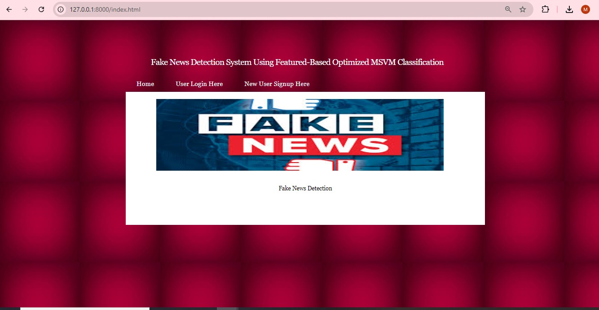
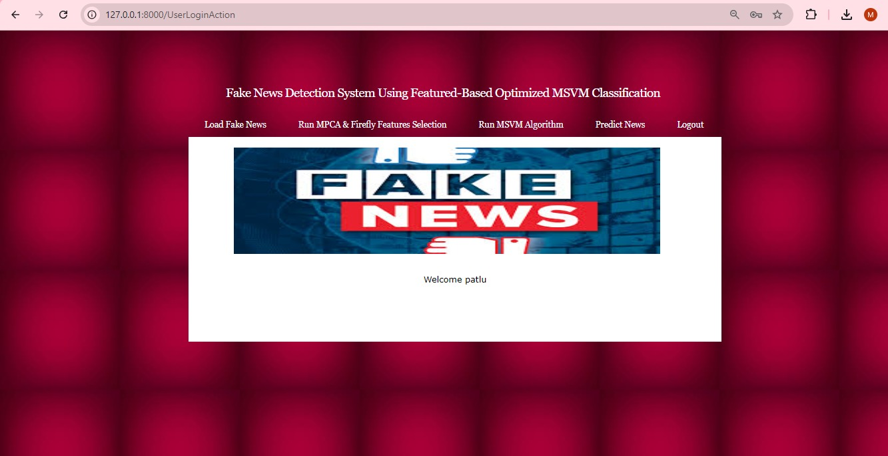
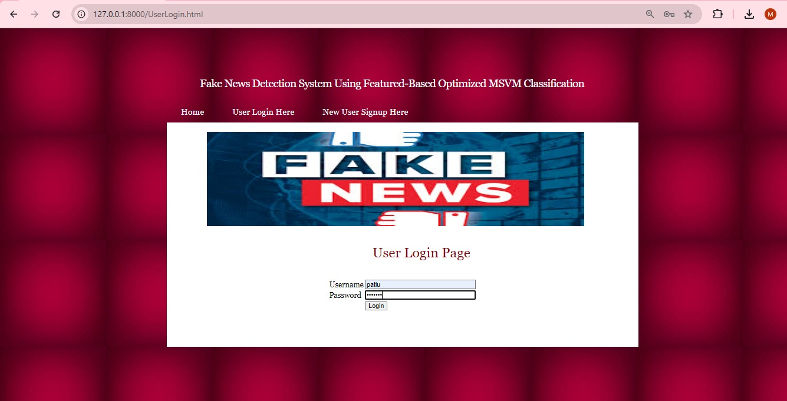
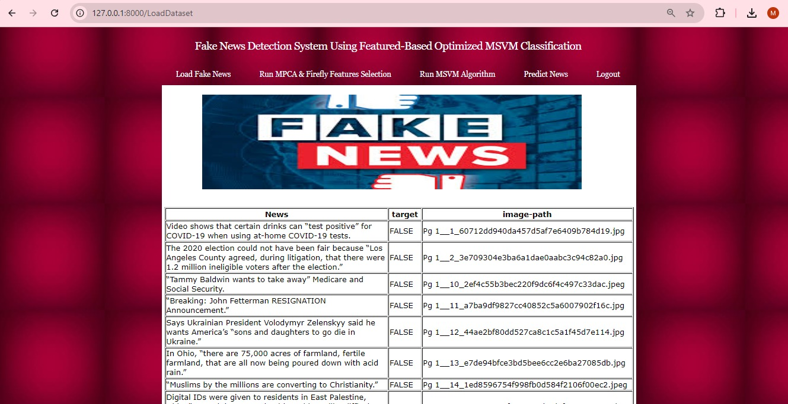
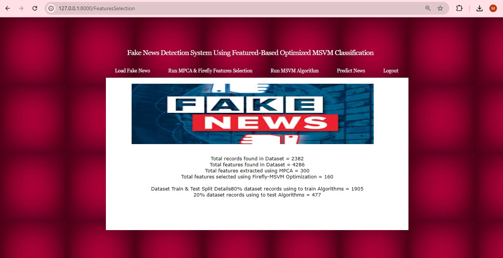
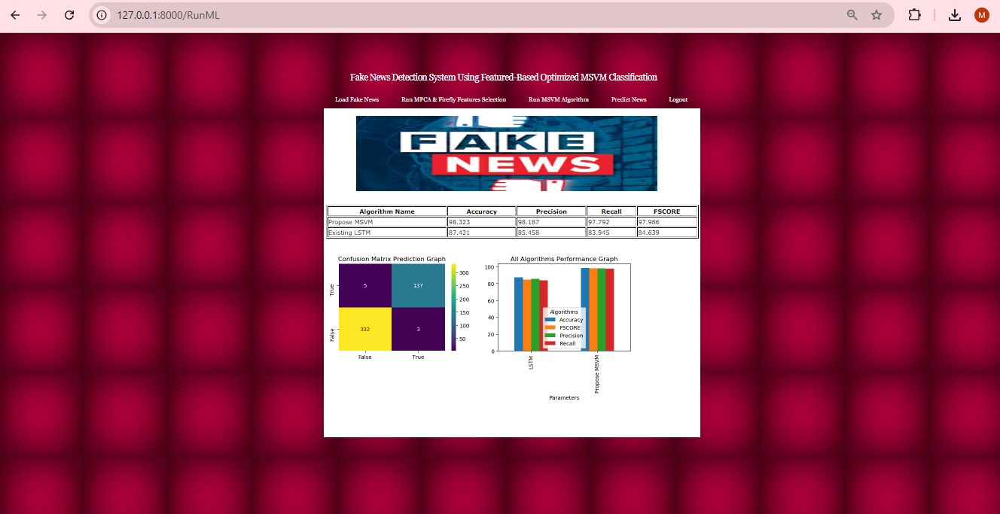
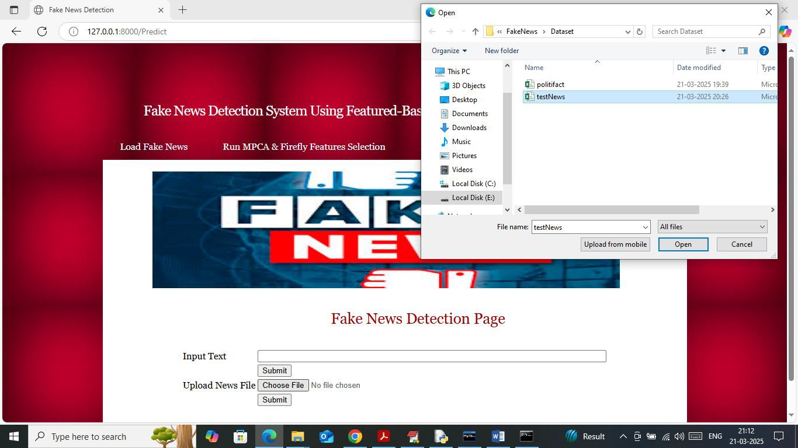

# 📰 Fake News Detection System

A machine learning-based web application developed to detect **Fake News** using data science and machine learning techniques.

The project uses **Firefly Algorithm-based feature optimization** with **Multi-class Support Vector Machine (MSVM)** classification and integrates the detection system into a **Django web application**.

---

## 🎯 Project Objective

The objective of this project is to develop an automated system that analyzes news data and classifies news as **Fake or Real** using machine learning techniques.

The project combines machine learning implementation with a web-based interface, allowing users to interact with the fake news detection system.

---

## 🚀 Key Features

* 📰 Fake News Detection
* 🔥 Firefly Algorithm-based Feature Optimization
* 🧠 Multi-class Support Vector Machine (MSVM)
* 🌐 Django Web Application
* 👤 User Registration and Login
* 📂 Dataset Loading and Processing
* 🔍 Feature Selection
* 🤖 Machine Learning Model Execution
* 📝 News Text Input
* ✅ Fake/Real News Prediction
* 💾 Stored Model and Feature Files
* 🎨 HTML & CSS-based User Interface

---

## 🧠 Methodology

The project follows a data science and machine learning workflow.

### 1. Dataset

News datasets are used for developing and testing the fake news detection system.

The repository contains:

```text
Dataset/
├── politifact.csv
└── testNews.csv
```

### 2. Data Processing

The news data is loaded and processed to prepare it for machine learning.

### 3. Feature Selection and Optimization

The **Firefly Algorithm** is used as an optimization technique for feature selection/optimization.

The implementation is included in:

```text
FireflyMSVM.py
```

### 4. MSVM Classification

The optimized feature representation is used with a **Multi-class Support Vector Machine (MSVM)** classifier for news classification.

### 5. Django Integration

The machine learning components are integrated into a Django web application.

The application provides functionality for:

* User registration
* User login
* News input
* News processing
* Fake/Real prediction

---

## 🛠️ Technologies Used

| Technology            | Purpose                          |
| --------------------- | -------------------------------- |
| **Python**            | Programming and Machine Learning |
| **Django**            | Web Application Development      |
| **MSVM**              | News Classification              |
| **Firefly Algorithm** | Feature Optimization             |
| **NumPy**             | Data and Numerical Processing    |
| **HTML**              | Frontend                         |
| **CSS**               | User Interface Styling           |
| **MySQL**    | Database Configuration           |
| **Git & GitHub**      | Version Control                  |

---

## 📊 Dataset

The project includes news datasets used during the development of the detection system.

```text
Dataset/
├── politifact.csv
└── testNews.csv
```

Additional dataset information is provided in:

```text
datasetLink.txt
```

---

## 📦 Project Structure

```text
Fake-News-Detection-System/
│
├── Dataset/
│   ├── politifact.csv
│   └── testNews.csv
│
├── Fake/
│   ├── settings.py
│   ├── urls.py
│   └── wsgi.py
│
├── FakeApp/
│   ├── migrations/
│   ├── static/
│   ├── templates/
│   ├── admin.py
│   ├── models.py
│   ├── urls.py
│   └── views.py
│
├── model/
│   ├── X.npy
│   ├── Y.npy
│   ├── data.npy
│   ├── firefly.npy
│   ├── lstm_history.pckl
│   ├── lstm_weights.hdf5
│   └── pca.pckl
│
├── FireflyMSVM.py
├── manage.py
├── requirements.txt
├── test.py
├── database.txt
├── datasetLink.txt
├── runWebServer.bat
└── .gitignore
```

---

## 📸 Project Screenshots

### 1. 🏠 Home Page



### 2. 📝 User Registration



### 3. 🔐 User Login



### 4. 📂 Dataset Loading



### 5. 🔍 Feature Selection



### 6. 🤖 Machine Learning Execution



### 7. 📰 News Text Input


### 8. ✅ News Prediction


### 9. 🗂️ File Updation



### 10. 📄 News Updation


---

## ⚙️ Installation

### 1. Clone the Repository

```bash
git clone https://github.com/MeghamalaBaipothu/Fake-News-Detection-System.git
```

### 2. Navigate to the Project

```bash
cd Fake-News-Detection-System
```

### 3. Create a Virtual Environment

```bash
python -m venv venv
```

### 4. Activate the Virtual Environment

**Windows:**

```bash
venv\Scripts\activate
```

### 5. Install Dependencies

```bash
pip install -r requirements.txt
```

---

## ▶️ Run the Django Application

Start the Django development server:

```bash
python manage.py runserver
```

The application will normally be available at:

```text
http://127.0.0.1:8000/
```

Open the local server address in your browser.

### Windows Alternative

The repository also contains:

```text
runWebServer.bat
```

which can be used to start the Django development server on Windows.

To demonstrate the project run this in cmd:
```cd /d C:\FakeNews
venv\Scripts\activate
python manage.py runserver```

Then open:
```http://127.0.0.1:8000/```

### Application Templates

The Django templates are located in:

```text
FakeApp/templates/
```

The main pages include:

* `index.html` — Home page
* `Register.html` — User registration
* `UserLogin.html` — User login
* `UserScreen.html` — User interface
* `Predict.html` — Prediction page

> **Note:** These are Django templates and should be accessed through the Django application's configured URL routes rather than by directly opening `index.html` in a browser.

---

## 🗄️ Database

The project uses MySQL for database-related functionality.

Database-related information and SQL structure are provided in:

database.txt

The database must be configured according to the local development environment before running the application.

For security, database passwords, API keys, and other sensitive credentials should not be committed to the repository.

---

## 📚 Research Publication

This project is associated with the research paper:

### **“Detection of Fake News Through Implementation of Data Science Application”**

**Publication:** IJCRT
**Team:** 4 Members 
**Role:** Team Leader & Co-Author

The research work was completed collaboratively by a four-member student team under the guidance of one faculty/project guide.

---

## 👩‍💻 My Role

### **MEGHAMALA BAIPOTHU**

**Team Leader & Co-Author**

As the team leader and co-author, I contributed to the collaborative development of the Fake News Detection System, including machine learning implementation, project coordination, and integration of the detection system with the Django web application.

---

## 🔮 Future Enhancements

* Deploy the application to a cloud platform
* Improve UI responsiveness and accessibility
* Add larger and more diverse datasets
* Compare additional machine learning algorithms
* Add model performance visualizations
* Improve prediction capabilities
* Add automated testing
* Develop a prediction API

---

## ⭐ Project Repository

If you find this project useful, consider giving the repository a ⭐.

**GitHub Repository:**

https://github.com/MeghamalaBaipothu/Fake-News-Detection-System

---

## 👩‍💻 Developer

**MEGHAMALA BAIPOTHU**

Computer Science & Engineering | Data Science & Machine Learning

**Areas of Interest:**

* Data Science
* Machine Learning
* Python
* SQL
* Power BI
* Artificial Intelligence
* Django
